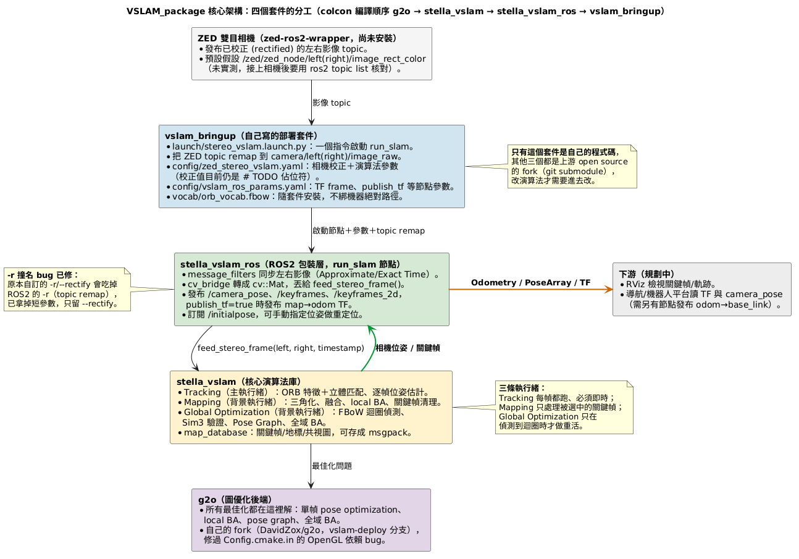
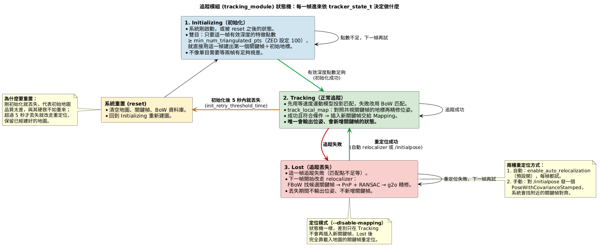
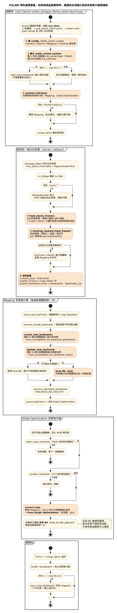

# VSLAM_package

以 [stella_vslam](https://github.com/stella-cv/stella_vslam)(BSD 2-Clause,可商用)為核心的雙目 VSLAM 專案,
目標是透過 ROS2([stella_vslam_ros](https://github.com/stella-cv/stella_vslam_ros))部署到 ZED 雙目相機。

## 目前狀態

- [x] 本地端核心算法建好,用 TUM RGBD 資料集驗證過完整 SLAM 流程與精度(APE RMSE ≈ 6 cm)
- [x] 參數實驗工具 `run_experiment.sh` / `view_experiment.sh`,`configs/` 底下多組單一變數實驗
- [x] ROS2:`./colcon_build.sh` 在 ROS2 Jazzy 容器一次編完四個套件,`ros2 launch` 實際啟動節點、不會當掉
- [ ] 還沒接真的 ZED 相機:校正參數、topic 名稱、TF frame 都還是佔位符(見 [`vslam_bringup/README.md`](vslam_bringup/README.md))

## 架構圖解

圖檔與 `.puml` 在 [`docs/images/`](docs/images/),改圖請改 [`docs/流程圖產生器.py`](docs/流程圖產生器.py) 再執行
`python3 docs/流程圖產生器.py`(需要能連到 plantuml.com)。

### 1. 核心架構:四個套件的分工



| 套件 | 性質 | 負責 |
|---|---|---|
| `g2o/` | 上游 fork(submodule) | 圖優化後端,所有 BA / pose graph 都在這裡解 |
| `stella_vslam/` | 上游 fork(submodule) | 核心演算法:Tracking / Mapping / Global Optimization 三條執行緒 |
| `stella_vslam_ros/` | 上游 fork(submodule) | ROS2 包裝層:`run_slam` 節點,訂閱影像、發布位姿/TF |
| `vslam_bringup/` | **自己的程式碼** | launch 檔 + ZED 參數 YAML + 詞彙檔 |

### 2. 追蹤模組的狀態轉移



雙目第一幀有效深度點夠多就直接初始化;追蹤失敗進 Lost,靠 FBoW + PnP 重定位救回;
初始化後 5 秒內就丟失則整個重置。

### 3. 資料處理管線



前景每幀做 ORB 擷取 → 立體匹配 → 位姿估計 → 發布;Mapping 與 Global Optimization 在背景執行緒處理關鍵幀、
迴圈偵測與全域 BA,不擋即時追蹤。各模組演算法的詳細說明見 `VSLAM_package_complete/doc/VSLAM_pipeline.md`。

## 資料夾結構

```
VSLAM_package/
├── build.sh / env.sh        本地端建置(g2o → stella_vslam → stella_vslam_examples → local_install/)
├── colcon_build.sh          ROS2 建置(四個套件一次編完 → install/)
├── run_experiment.sh        參數實驗:跑 config、算 APE、存標註影格/影片/軌跡圖
├── view_experiment.sh       同一組資料開 PangolinViewer 即時看
├── configs/                 baseline.yaml(對照組)+ exp_*.yaml(單一變數實驗)+ ZED_stereo.yaml
├── docs/                    tunable_parameters.md(~105 個可調參數)、zed_stereo.md、pangolin_viewer.md、images/
├── src/                     colcon workspace,symlink 指回下面四個資料夾(見 src/README.md)
├── g2o/ stella_vslam/ stella_vslam_examples/ stella_vslam_ros/   【submodule,自己的 fork】
├── vslam_bringup/           自己寫的 ROS2 bringup 套件
└── local_install/ vocab/ datasets/ install/ build/ log/   （不進版控,建置/下載產物）
```

## 本地端測試(不需要 ROS2)

```bash
git clone --recurse-submodules https://github.com/DavidZox/VSLAM_package.git && cd VSLAM_package
# 已經用一般 git clone 下載(g2o/、stella_vslam/ 等資料夾是空的)的話,在 VSLAM_package 裡補抓:
git submodule update --init --recursive

sudo apt install -y build-essential cmake git libopencv-dev libeigen3-dev libyaml-cpp-dev libsuitesparse-dev libsqlite3-dev
./build.sh                    # 編譯到 local_install/,並下載 vocab/orb_vocab.fbow
```

`g2o/`、`stella_vslam/`、`stella_vslam_examples/`、`stella_vslam_ros/` 是 submodule,一般 `git clone` 只會建出
空資料夾,一定要用上面兩種方式之一抓內容。另外這些不進版控,新 clone 的電腦要自己準備:

| 項目 | 怎麼產生 |
|---|---|
| `local_install/`、`vocab/` | `./build.sh` |
| `datasets/rgbd_dataset_freiburg1_xyz/`(約 450 MB,實驗腳本用) | 下面的下載指令 |
| `pangolin/`、`pangolin_viewer/`(只有 `view_experiment.sh` 開視窗需要) | 見 [`docs/pangolin_viewer.md`](docs/pangolin_viewer.md) |

```bash
mkdir -p datasets && curl -L https://cvg.cit.tum.de/rgbd/dataset/freiburg1/rgbd_dataset_freiburg1_xyz.tgz | tar -xz -C datasets
```

所有腳本(`build.sh`、`colcon_build.sh`、`run_experiment.sh`、`view_experiment.sh`、`env.sh`)都以自己所在的位置
當專案根目錄,clone 到任何路徑都能直接用,不用改路徑。

參數實驗固定用 TUM RGBD `freiburg1_xyz` 當基準:

```bash
cp configs/baseline.yaml configs/exp_我的實驗.yaml       # 改一個參數,開頭註解寫改了什麼、預期如何
./run_experiment.sh configs/exp_我的實驗.yaml exp_我的實驗 [--video]   # 結果在 datasets/eval_<名稱>/
./view_experiment.sh configs/exp_我的實驗.yaml           # 開視窗看(要在有 GPU/WSLg 的終端機執行)
```

⚠️ 初始化的 RANSAC 預設沒固定種子,同一份 config 重跑 APE 也會浮動。效果不明顯的參數請多跑 2~3 次,
或設 `Initializer.use_fixed_seed: true`。

## ROS2 部署

```bash
source /opt/ros/<distro>/setup.bash
./colcon_build.sh            # g2o → stella_vslam → stella_vslam_ros → vslam_bringup
source install/setup.bash
ros2 launch vslam_bringup stereo_vslam.launch.py \
  left_image_topic:=<ZED 左眼 topic> right_image_topic:=<ZED 右眼 topic>
```

- 訂閱 `camera/left/image_raw`、`camera/right/image_raw`(launch 檔負責 remap)
- 發布 `~/camera_pose`(Odometry)、`~/keyframes`/`~/keyframes_2d`(PoseArray),`publish_tf: true` 時發布 `map→odom`
- 定位模式:`run_slam` 加 `-i <地圖檔> --disable-mapping`;建圖結束存檔用 `-o <地圖檔>`
- 接相機前要填的三件事(校正值、topic 名稱、TF frame)見 [`vslam_bringup/README.md`](vslam_bringup/README.md)

## 已知眉角

- CMake 4.x 會拒絕舊的 `cmake_minimum_required(3.1)`,需加 `-DCMAKE_POLICY_VERSION_MINIMUM=3.5`(已寫進腳本)
- Ubuntu 的 `libg2o-dev` 沒附 CMake config,g2o 只能從原始碼編;fork 裡已修掉 `Config.cmake.in` 無條件要求 OpenGL 的 bug
- `stella_vslam_ros`、`stella_vslam_examples` 都有巢狀 submodule,`git submodule update` 一定要加 `--recursive`
- `stella_vslam_ros` 在 fork 裡修了三個問題:重複的 `ament_environment_hooks()`、Jazzy 的 `cv_bridge.h`→`.hpp`、
  **自訂 `-r/--rectify` 跟 ROS2 `-r`(remap)撞名導致節點當掉**(已拿掉短參數 `-r`)
- `ros2 launch ... --show-args` 只印參數、不會啟動節點,驗證一定要真的啟動
- `colcon.pkg` 的逐套件 cmake 參數在此 colcon 版本不生效,改在 `colcon_build.sh` 一次給全部旗標

## 版控說明

四個上游 repo 以 submodule 引用自己的 fork(`DavidZox/*`,各自設 `upstream` remote 指回原 repo)。
預設分支不同:`stella_vslam`/本 repo 是 `main`,`stella_vslam_ros` 是 `ros2`,`g2o` 的修正在 `vslam-deploy` 分支。

**改到 submodule 裡的檔案時,一定先推 submodule、再推主 repo 的指標**(反過來別人 clone 會抓不到 commit):

```bash
cd stella_vslam_ros && git commit -am "..." && git push origin ros2   # 第 1 層
cd .. && git add stella_vslam_ros && git commit -m "Bump stella_vslam_ros" && git push origin main   # 第 2 層
```
