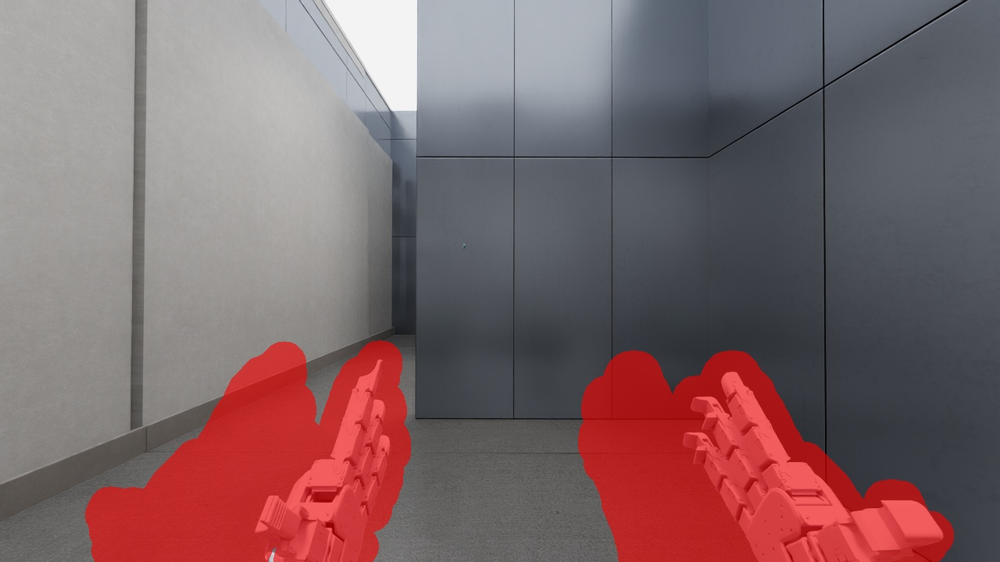
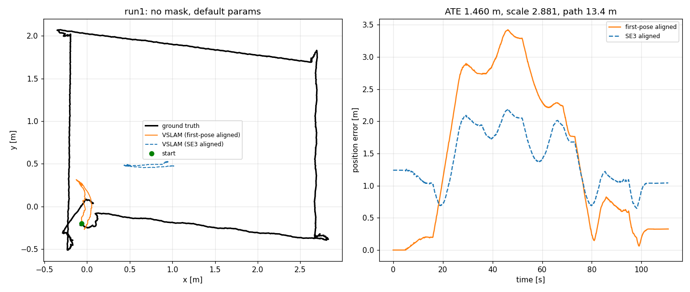
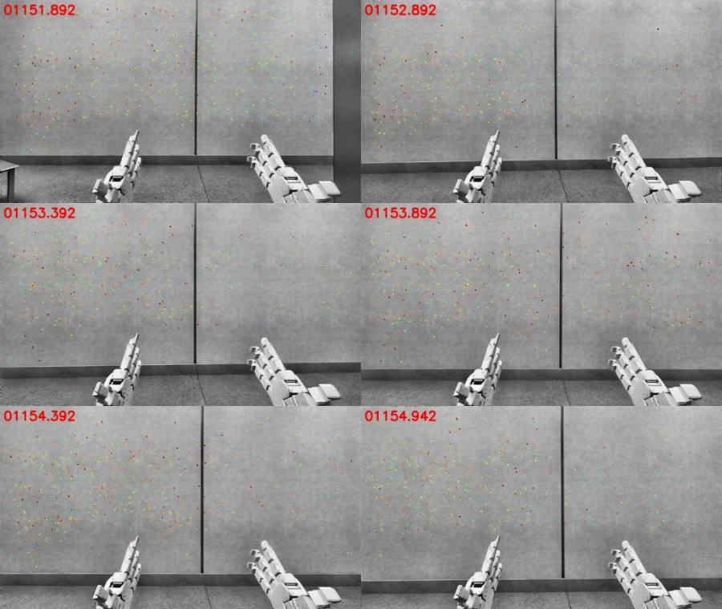
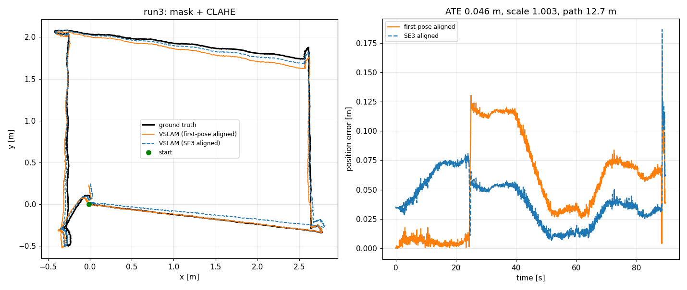
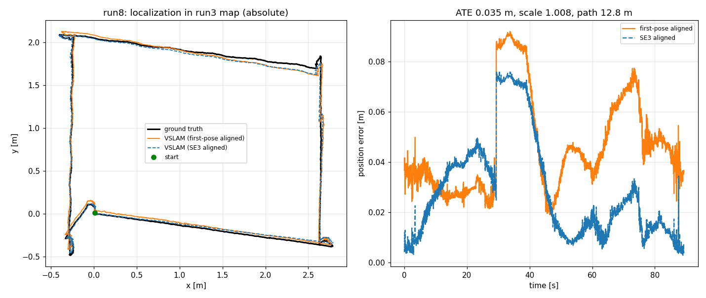
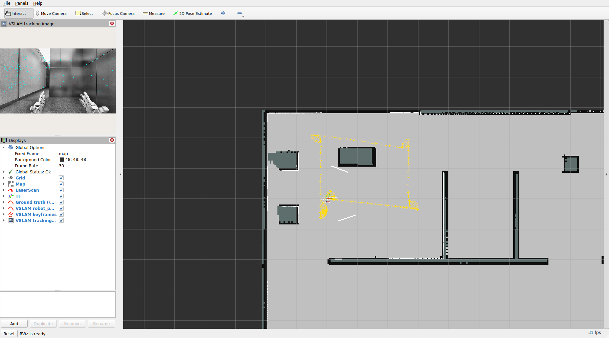

# Isaac Sim 機器人 — VSLAM 對接筆記

把 stella_vslam 接到 `fih_humanoid_amr` 的 Isaac Sim 場景(`Scene/`)跟機器人端(`amr_base_sw`)的過程記錄。
怎麼跑見 [`vslam_bringup/README.md`](../vslam_bringup/README.md)「Isaac Sim 機器人對接」;這份記錄的是「看到了什麼、
為什麼這樣設」,數值都是 2026-09-30 在 DGX Spark(GB10)上實測的。

## 1. 整體架構

```
Isaac Sim(主機,Scene/run_sim.sh)              amr-base-dev 容器(機器人端)
  頭上 ZED X:L_HEAD_J2/ZED_X/CameraLeft|Right      start_sim_and_spawn_IsaacSim.launch.py
  /zed_camera_left|right/image_raw  ──┐           robot_state_publisher、odom_tf_broadcaster、AMCL、Nav2 ...
  /zed_camera_left|right/camera_info  │           TF:map -> odom -> L_BASE_FOOTPRINT -> ... -> L_HEAD_J2
  /odom /clock /joint_states_in ...   │                       │
                                      ▼                       ▼
                         vslam-dev 容器(./ros2_container.sh,同一個 ROS_DOMAIN_ID)
                           isaac_stereo_vslam.launch.py
                             static TF:L_HEAD_J2 -> zed_left|right_camera_link -> zed_left|right_camera_frame
                             run_slam(stella_vslam_ros):遮罩 + CLAHE + 雙目追蹤/建圖
                               -> /run_slam/camera_pose、/run_slam/robot_pose、/run_slam/keyframes、
                                  /run_slam/tracking_state、/run_slam/tracking_image、TF odom -> vslam_map
```

主機本身沒有 ROS2(`/opt/ros` 不存在),VSLAM 的 ROS2 部分放在 `vslam-dev` 容器裡編譯執行。容器用機器人端同一個
`amr_base` 映像(已經有 ROS2 Jazzy 跟所有編譯依賴),掛載這個 repo,`--network host --ipc host`,DDS 直接互通。

## 2. 觀察到的機器人視覺資訊

| topic | 內容(實測) |
|---|---|
| `/zed_camera_left/image_raw`、`/zed_camera_right/image_raw` | `sensor_msgs/Image`,`rgb8`,1280 x 720(每張 2.7 MB),frame_id `zed_left_camera_frame` / `zed_right_camera_frame`;QoS RELIABLE / KEEP_LAST(10) |
| `/zed_camera_left/camera_info`、`/zed_camera_right/camera_info` | 左右完全相同:K = [490.6666, 0, 640; 0, 490.6666, 360; 0, 0, 1],D 全 0,**右眼 P[3] = 0(沒有基線)** |
| `/zed_camera_depth/image_raw` | 深度圖,frame `zed_depth_camera_frame`,**是從 CameraRight 渲染的**(真的 ZED 深度對齊左眼,這裡不是) |
| `/clock` | 模擬時間;每個 render frame 前進 1/60 s,模擬約 **0.24 倍實時**(牆鐘約 14 Hz) |
| `/odom` | Isaac 從底盤剛體位姿算的 odometry(`odom` -> `L_BASE_FOOTPRINT`),模擬裡等於真值 |

- 影像跟 camera_info 每個 render frame 都有發(牆鐘約 14 Hz),左右時間戳完全相同,相鄰幀差 1/60 s(模擬時間)。
  `ros2 topic hz` 對影像只量到約 2 Hz,那是 Python 反序列化 2.7 MB 訊息太慢,不是真的掉幀(用 raw 訂閱量是 14 Hz)。
- 內參:USD 相機 focalLength 2.208 mm、horizontalAperture 5.76 mm → fx = 2.208 / 5.76 × 1280 = 490.667,跟 camera_info 一致。
- 基線:Isaac 每顆相機獨立發 camera_info,P[3] 沒填。從場景 USD 量 CameraLeft -> CameraRight = **0.11988 m**
  (沿相機 +x,沒有相對旋轉),focal_x_baseline = 490.6666 × 0.11988 = 58.8211。
- 外參:相機是 `L_HEAD_J2` 的子節點,左 (0.09, +0.05994, -0.02)、右 (0.09, -0.05994, -0.02),光軸朝 L_HEAD_J2 的 +x。
  URDF 的 `L_HEAD_J2` 跟 USD 同一個座標系(TF `base_link -> L_HEAD_J2` = (0.003, 0, 0.915)、俯仰 -0.01 rad,跟 USD 一致),
  但**機器人 URDF 沒有相機 link**,TF 樹裡原本沒有 `zed_left_camera_frame`,launch 檔用 static_transform_publisher 補上。
  左相機在地面上方 1.290 m。

這些數值都寫進 `vslam_bringup/config/isaac_zedx_stereo.yaml`(Camera)跟 `isaac_zedx_camera_tf.yaml`(外參),
換解析度或場景時用 `camera_info_to_stella_yaml.py` 重新量/檢查。

## 3. 對接時遇到的問題與處理

### 3.1 相機看得到機器人自己的雙手(最嚴重)



畫面下半部是機器人的雙手,手跟相機一起動、在影像裡位置固定,特徵點又比素色牆多。不遮的話 VSLAM 會被手拉住,
以為相機沒在動:run1 繞 13.4 m 的矩形,估計軌跡只在起點附近 0.4 m 內打轉,Sim3 尺度 2.88、ATE 1.46 m。



處理:`make_self_mask.py` 用 SGBM 雙目視差找「一直在 1 m 內」的像素(地面在畫面底緣約 1.76 m,不會被當成本體),
左右兩個參考視角取聯集(stella_vslam 左右影像共用一張遮罩)、閉運算補洞、膨脹 25 px,產生
`config/isaac_zedx_self_mask.png`(遮掉 17.8% 像素)。手臂姿勢改了要重拍。

### 3.2 牆面/地面紋理太弱

加了遮罩後(run2),追蹤時精度正常(ATE 4.3 cm、尺度 1.07,代表內參跟基線是對的),但開到素色牆前 8.8 s 就
tracking lost,之後完全抽不到特徵(`preprocess: cannot extract any keypoints`),回到起點也沒有重定位成功。

量了一張正對牆的畫面(遮罩後):原圖 FAST 門檻 20 / 7 / 3 分別只有 6 / 20 / 1364 個角點;先做 CLAHE
(clipLimit 3、8x8)之後是 50 / 12389 / 29348 個。牆面其實有水泥材質紋理,只是對比太低。這是真的表面紋理,
雙目匹配跟跨幀追蹤都能用,所以在 ROS wrapper 加了 `clahe_clip_limit` 參數(影像轉灰階做 CLAHE 再餵給
stella_vslam),FAST 門檻維持預設,不去降門檻抓雜訊。

### 3.3 其他

- **QoS 要 RELIABLE**:用 BEST_EFFORT 訂閱 10 秒只收到 1 張影像。2.7 MB 的影像會切成約 2000 個 UDP 片段,
  主機 `net.core.rmem_max` 只有 208 KB,掉任何一片整張就沒了;RELIABLE 會補傳。stella_vslam_ros 雙目本來就是
  RELIABLE,不用改;要改 QoS 的話先把 rmem_max 調大(需要 sudo)。
- **模擬時間**:時間戳是模擬時間,`use_sim_time: true`。上游 wrapper 用 `node->now()` 量追蹤耗時,開模擬時間
  後量到的是模擬時鐘(每幀都是 0.0167 s),改成 steady clock。Camera.fps 填 60(模擬時間的幀率)。
- **左右同步**:同一幀渲染、時間戳相同,改用 ExactTime(`use_exact_time: true`),掉幀時不會把不同時間的左右影像湊成一對。
- **map -> odom 不能搶**:機器人端 AMCL 已經在發 `map -> odom`。VSLAM 預設 `publish_tf: false`、地圖座標系叫
  `vslam_map`,另外在地圖第一筆位姿時發一個靜態 TF `odom -> vslam_map`(`map_parent_frame`,也可以改掛在 `map`
  底下),讓 VSLAM 輸出能跟機器人畫在同一棵 TF 樹上。
- **地圖原點貼地**:上游的地圖原點是「第一幀的相機」,相機在 1.29 m 高的頭上、會跟著頭俯仰傾斜。加了
  `map_frame_origin: robot_base`,地圖原點改成建圖當下的 `L_BASE_FOOTPRINT`,`vslam_map` 跟 odom 一樣貼地水平。
- **/initialpose**:機器人端啟動時會對 AMCL 送 `/initialpose`,run_slam 預設也訂這個 topic,launch 改接
  `/vslam/initialpose`。
- **TF 流量**:機器人手指關節很多,`/tf` 約 144 則/秒,Python 的 TF listener 會落後;驗證工具的真值改用 `/odom` ×
  一次查好的外參,不逐筆查 TF。
- **讓機器人動起來**:Nav2 `navigate_to_pose` 用預設 BT 會 abort(controller_server 有 general/docking 兩個
  goal checker,預設 BT 沒指定,平常由 amr_base_sw 自己的節點帶 id 呼叫),驗證改用 `drive_waypoints.py` 直接發
  `/cmd_vel` 沿路網節點走。
- **容器 DDS**:同一台主機 participant 很多,CycloneDDS 參與者索引上限要拉到 100(`vslam_bringup/config/cyclonedds.xml`,
  內容跟機器人端 `cyclonedds.devcontainer.xml` 相同),不然新節點會起不來。

### 3.4 正對平面牆:目前主要的誤差來源

遮罩 + CLAHE 之後整圈都不會 lost,但每一次都在同一段出現大誤差:a6 轉角原地轉向朝北、沿著 a6 -> a5 往前走
的時候,估計的前進量明顯比真值少(下表「a6 轉角少估前進量」),yaw 也會漂 3~5°,之後這段偏差一直帶著,
回到起點有偵測到 loop closure 才修掉(8 次裡 run5、run6 沒偵測到,終點誤差就留著)。



看那段的追蹤影像(`tracking_image`):整個畫面只有 2.5~3 m 外一整面平坦的水泥牆,所有追蹤點都在同一個跟相機
平行的平面上,近處地面被雙手跟遮罩擋掉大半。這是視覺 SLAM 已知的退化情況——單一正對平面時,「橫向平移」跟
「偏航旋轉」在影像上幾乎分不出來,往前走也只剩微弱的放大量可以用;CLAHE 放大出來的類隨機紋理又讓特徵容易配錯。

試過的處理:

| 做法 | 結果 |
|---|---|
| `depth_threshold` 40 -> 5(不用單幀雙目直接建遠點) | 沒改善(轉角少估 57 cm、ATE 27.9 cm),維持 40 |
| 輪式里程計當追蹤的運動先驗:下一幀 `motion_based_track` 的初始猜測改用 TF `odom -> 相機` 算的兩幀相對運動,取代等速模型 | 各跑兩次沒有可量測的差異(起步 0.3 m 時落後:等速模型 1.4 / 24.8 cm,運動先驗 0.1 / 21.6 cm),沒有採用,程式也拿掉了 |

運動先驗只改「從哪裡開始找對應點」,位姿還是完全由影像的重投影誤差決定;平面退化是最佳化本身在那幾個方向
約束不足,所以光給初始猜測救不了,要在位姿估計裡直接加里程計的約束(緊耦合)或在下游融合。

要真正解決這段,得讓 VSLAM 看到非平面的結構(手臂姿勢別擋住地面、場景牆面加紋理/物件),或在下游把 VSLAM 跟
輪式里程計融合(例如 robot_localization EKF,VSLAM 提供不漂移的位置、里程計撐過退化的那幾秒)。

### 3.5 編譯:改了 stella_vslam 標頭之後增量編譯會編錯

stella_vslam 的 FBoW 是 submodule,會跟著裝進 install prefix。第二次以後編譯時,`find_package(fbow)` 會找到
上一次裝的那份,而它的 `fbowConfig.cmake` 會 `include_directories(<install>/include)`——那裡也放著**舊版**的
stella_vslam 標頭,而且排在原始碼前面,只要改過 stella_vslam 的標頭就會編錯(這次加 `set_motion_prior` 就踩到)。
已在 `stella_vslam/src/stella_vslam/CMakeLists.txt` 找 fbow 時排除自己的 install prefix,colcon 跟本地 `build.sh`
都適用。另外 `ros2_container.sh build` 編譯時不 source `install/setup.bash`。

## 4. 驗證

路線:路網 a7 -> a6 -> a5 -> a8 -> a7 -> 起點,約 12.7~13.4 m、4 個 90° 原地轉向,線速度 0.3 m/s(模擬時間)。
真值是 Isaac `/odom` × 相機外參;`evaluate_trajectory.py` 算 ATE(SE3 對齊)、Sim3 尺度、只用第一個位姿對齊的
終點誤差(= 即時定位會看到的累積漂移)。下表都是**即時發布的位姿**(`/run_slam/camera_pose`),
不是事後最佳化過的軌跡。每次結果的原始檔在 `datasets/isaac_eval/<run>/`(不進版控)。




| run | 設定 | ATE (SE3) | Sim3 尺度 | 終點誤差(起點對齊) | loop | a6 轉角少估前進量 |
|---|---|---|---|---|---|---|
| run1 | 不遮罩、不做 CLAHE | 1.46 m | 2.88 | 0.33 m | - | 估計軌跡只在起點 0.4 m 內(被雙手拉住) |
| run2 | 遮罩 | 4.3 cm(只追到前 8.8 s / 1.4 m) | 1.07 | - | - | 8.8 s 後 lost,沒救回 |
| run3 | 遮罩 + CLAHE | 4.6 cm | 1.003 | 3.9 cm | 有 | 11.7 cm |
| run4 | 同 run3(正式 launch、`ros2_container.sh` 重建容器後) | 17.1 cm | 1.017 | 1.0 cm | 有 | 49.6 cm |
| run5 | run4 + `depth_threshold: 5` | 27.9 cm | 1.015 | 36.7 cm | 沒有 | 57.1 cm |
| run6 | run4 + 輪式里程計運動先驗 | 18.5 cm | 1.011 | 24.7 cm | 沒有 | 31.7 cm |
| run7 | run4 + 輪式里程計運動先驗 | 15.1 cm | 1.017 | 0.1 cm | 有 | 44.4 cm |
| run8 | 載入 run3 的地圖、`disable_mapping:=true` | 3.5 cm | 1.008 | 3.6 cm(相對建圖座標系) | - | 1.0 cm |

- run3 跟 run4 的設定等價(run3 用的暫時設定檔省略的欄位都是預設值),差異就是每次執行的變異;回到起點做完
  loop closure 之後,兩次的終點誤差都在 4 cm 內,事後最佳化的完整軌跡(`frame_trajectory.txt`)ATE 4.2 / 14.9 cm。
- run8 載入地圖後第一幀就重定位成功,整圈沒有 lost。用 run3 的第一筆位姿定義建圖座標系(`--align-from`)量的是
  **絕對**定位誤差:RMSE 5.0 cm、起點 3.7 cm、終點 3.6 cm;兩次的 `odom -> vslam_map` 差 4.2 cm、yaw 0.5°。
  連 a6 那段平面牆都只少估 1 cm——有了經過 loop closure 跟全域 BA 的地圖點,那段的退化就不見了,所以實際用法
  建議「先繞一圈建圖(有 loop closure)存檔,之後載入地圖定位」。
- 追蹤耗時(steady clock)中位數約 37 ms、p90 約 55 ms,影像牆鐘間隔約 70 ms,跟得上。
- `depth_threshold` 跟運動先驗都沒有可量測的改善,沒有採用(運動先驗的程式也拿掉了,不在 stella_vslam 核心留沒
  被證實有用的 API)。

## 5. 給後續 SLAM / 定位行為用



| 用途 | 怎麼接 |
|---|---|
| 機器人位姿(VSLAM 估計) | `/run_slam/robot_pose`(`nav_msgs/Odometry`,`L_BASE_FOOTPRINT` 在 `vslam_map`) |
| 跟機器人其他資料畫在一起 / 換到 odom 座標 | TF `odom -> vslam_map`(靜態,地圖第一筆位姿時發),`tf2` 直接把 `vslam_map` 的東西轉到 `odom`/`map` |
| 判斷 VSLAM 可不可信 | `/run_slam/tracking_state`:`Lost` 時就不要用它的位姿 |
| 建圖存檔 / 載入定位 | `map_db_out:=...`,之後 `map_db_in:=... disable_mapping:=true`;`vslam_map` 的原點跟建圖那次一樣(假設相機裝法沒變) |
| 讓 VSLAM 接手 `map -> odom` | `publish_tf:=true map_frame:=map`,機器人端要先停掉 AMCL / slam_toolbox(目前的 launch 沒有這個選項)。**這條沒有實測**:機器人端 AMCL 在跑時一測就會搶同一段 TF,等機器人端有不跑 AMCL 的模式再驗證 |
| 把 VSLAM 地圖對齊到機器人既有的 `map` | launch 帶 `map_parent_frame:=map`:第一筆位姿時用 AMCL 當下的估計把 `vslam_map` 掛到 `map` 底下 |
| 載入地圖後給 VSLAM 重定位提示 | 對 `/vslam/initialpose` 送位姿(RViz `rviz:=true` 的 2D Pose Estimate 就是送這個 topic) |

## 6. 已知限制 / 待辦

- 正對平面素色牆的路段會低估前進量、yaw 漂移(3.4 節),目前靠 loop closure 事後修;要穩定的話在下游跟輪式
  里程計融合,或改善場景/手臂姿勢讓相機看得到地面跟立體結構。
- 本體遮罩只對目前的手臂姿勢有效,手臂動了要用 `make_self_mask.py` 重拍;遮罩是左右影像共用(聯集),會多遮掉
  一部分其實看得到的地面,之後可以考慮讓 stella_vslam 左右各用一張遮罩。
- 場景的深度相機(`zed_camera_depth`)是從 CameraRight 渲染的,跟真的 ZED(對齊左眼)不同;這次雙目 VSLAM 沒用到。
- 相機 TF 是 launch 補的靜態 TF,機器人 URDF 加上 ZED X link 後改 `publish_camera_tf:=false`。
- 模擬只有約 0.24 倍實時,影像牆鐘 14 Hz(模擬時間 60 fps)。VSLAM 每幀約 37 ms(中位數),實機 ZED 30/60 fps
  時要再確認算力是否跟得上。
- 不同次執行的結果變異不小(同一組設定 ATE 4.6 cm ~ 17 cm),主要來自 3.4 節那段;比較參數時至少各跑兩次。
